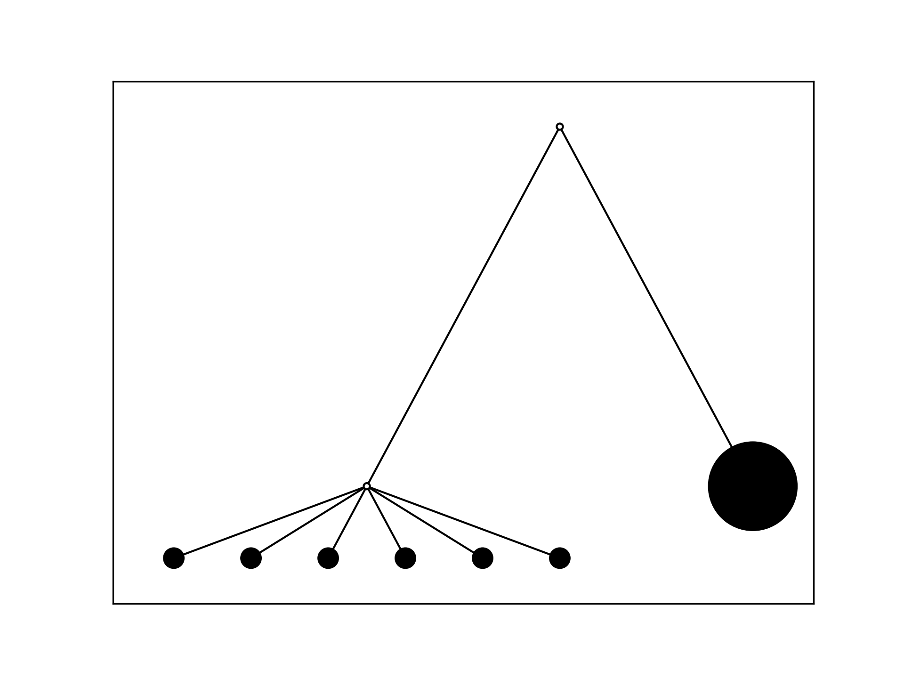

# GraphTree

A small script to plot trees.

## Installation

Just download the `graph_tree.py` file and import the relevant class using `from graph_tree import GraphV`.

## Usage

The `GraphV` object represents the tree along with characteristics required to visualize it. Here is an example script:

```python
graphv=GraphV([("int1","int2"),("int1","out1"),("int2","b1"),("int2","b2"),("int2","b3"),("int2","b4"),("int2","b5"),("int2","b6")],all_sizes={"b1":100,"b2":100,"b3":100,"b4":100,"b5":100,"b6":100,"out1":2000},default_size=0,empty_node_size=10,color="black")

graphv.generate_position()
graphv.decrease_edge_percent_regex(r"b\d",0.8)

graphv.save("out.png")
```

The `GraphV` object is initialized using a list of node connections. `all_sizes` takes in a dictionary of node ID-size pairs, and any nodes not specified will have size `default_size`. A size of `0` specifies that the node has no magnitude, although to visualize it, a size `empty_node_size` is specified. The color of the nodes is specified by `color`.

The above provides an abstract representation of a tree graph. The position of the nodes is generated via `graphv.generate_position()`, and any further manipulations that require concrete node positions must be called subsequent to this.

`decrease_edge_percent_regex` makes the edge length `percent` as much as it normally is for any nodes that have some ID name pattern.

Finally, the tree is saved to a file calling `save`.

The tree looks as follows:

